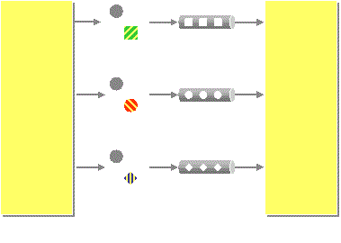

# Datatype Channel

El **Datatype Channel** es un patrón de integración empresarial que se utiliza para asegurar que los datos que se transmiten por un canal de comunicación entre sistemas estén correctamente estructurados y sea comprensible para el receptor del mensaje.

## ¿Qué es un Datatype Channel?

Es un canal de mensajería en una arquitectura de integración que transporta mensajes con un tipo de dato específico.

En otras palabras, cada canal está especializado para transportar mensajes que cumplen un formato o estructura de datos particular, como XML, JSON, objetos Java, etc.

## ¿Cómo funciona?

- **Diseño especializado:** Se define un canal que acepta solo un tipo de dato o estructura.

  **Ejemplo:**
  - **Canal 1:** Solo mensajes en formato XML.
  - **Canal 2:** Solo JSON con un esquema específico.

- **Validación implícita:** Cuando un productor envía un mensaje al canal, este debe cumplir con el tipo esperado. Si no, se produce un error o se ignora el mensaje.

- **Acoplamiento suave:** Los consumidores (receptores) pueden asumir el tipo de dato del mensaje, facilitando el procesamiento sin lógica extra para validaciones de formato.

## ¿Por qué usar Datatype Channels?

- **Evita errores de formato:** Garantiza que todos los mensajes en un canal tienen el mismo tipo de datos.
- **Simplifica el procesamiento:** Los consumidores no necesitan hacer verificaciones del tipo de mensaje.
- **Mejora la interoperabilidad:** Ayuda a integrar sistemas heterogéneos mediante conversión o normalización.

## Ejemplo simple

Supongamos que tienes un sistema de facturación y otro de inventario. Puedes tener dos canales separados:

- **Canal A:** para mensajes tipo Factura (JSON)
- **Canal B:** para mensajes tipo Producto (XML)

Si el sistema de facturación intenta enviar un mensaje de Factura al canal B, se rechaza o genera una excepción.

